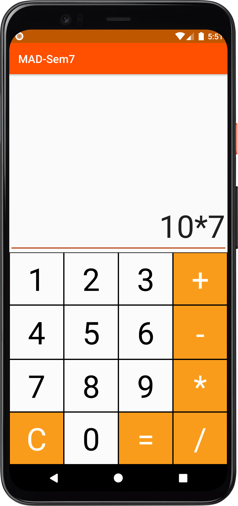
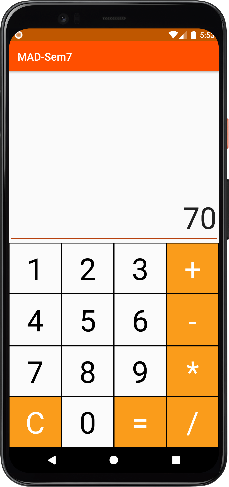

# CalC
 A simple android calculator made using java language and also utlising XML grid layout to structure the layout. This calculator also has commonly used MOD function feature which is missing in default calculator app available in android.

# Screenshots
 &nbsp; &nbsp; &nbsp; &nbsp; 
---

